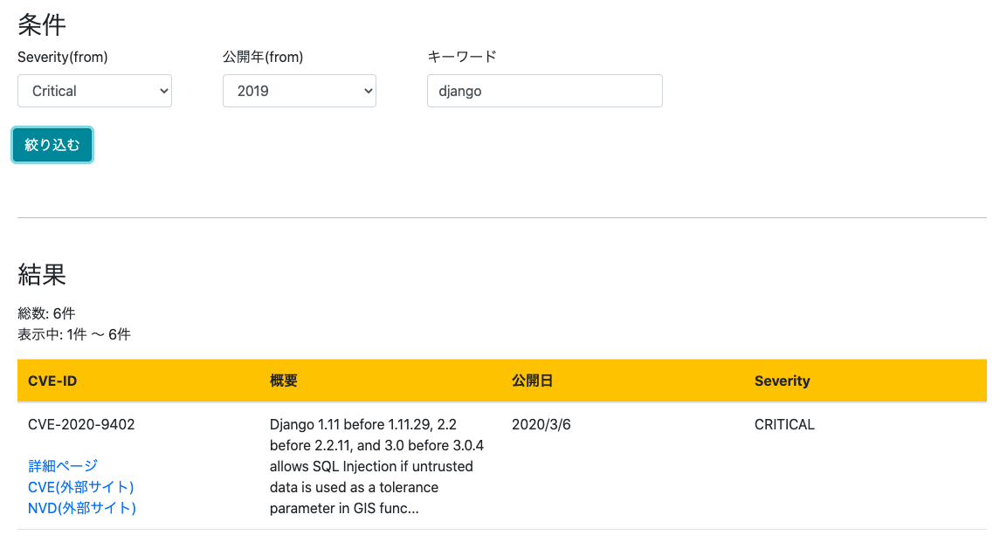
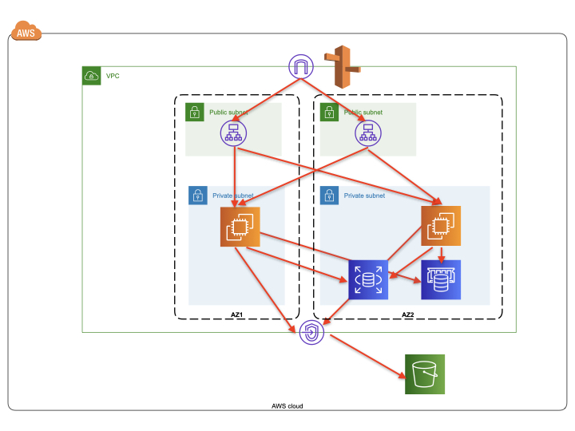

# cverooster(β版)

## 概要
CVE(Common Vulnerabilities and Exposures)を検索・管理できるサイトです。



## URL
<a href="https://cverooster.com/list/" target="_blank">https://cverooster.com/list/</a>

## 作成した背景
ソフトウェアの脆弱性に関する情報を人手で収集・管理するのが大変なので、そのためのサービスがあると便利だなと思って作成しました。

## 機能一覧
- CVE一覧画面
    - CVE一覧の表示
    - CVEのキーワードによる絞り込み
    - CVEのseverityによる絞り込み
    - CVEの発行年による絞り込み
    - 登録キーワードによる絞り込み(ログインユーザーのみ)
    - ステータスによる絞り込み(ログインユーザーのみ)
    - ステータス付与(ログインユーザーのみ)
    - コメント付与(ログインユーザーのみ)
- CVE詳細画面
    - 各CVEのCVSSスコアの視覚表示
- ユーザー登録
- キーワード登録画面(ログインユーザーのみ)
    - キーワード登録
- 設定画面(ログインユーザーのみ)
    - 絞り込み設定登録

## 使用した技術
- サーバーサイド
    - Python3系
    - Django3系
    - Django REST framework
    - Nginx
    - Gunicorn
- クライアントサイド
    - JQuery
    - Underscore.js(テンプレートに使用)
    - Bootstrap4
- インフラ
    - AWS
        - VPC
        - EC2
        - オートスケーリンググループ
        - Application Load Balancer
        - RDS(MySQL5.7)
        - ElastiCache(Redis)
        - S3
        - Route53
        - AWS Certificate Manager

## インフラ構成


## ローカル環境での実行手順
### ・前提
以下がインストールされていること
- Python3系
- Docker
- mysqlコマンド

### ・リポジトリをクローン
```shell
git clone https://github.com/kamatimaru/cverooster_api.git
```

### ・仮想環境構築
```shell
cd cverooster
python3 -m venv .venv
source .venv/bin/activate
```

### ・必要なパッケージのインストール
```shell
pip3 install -r requirements.txt
```

※ Macでmysqlclientのインストール時にエラーが発生する場合は以下の記事参照
<a href="https://kamatimaru.hatenablog.com/entry/2020/04/30/123939" target="_blank">https://kamatimaru.hatenablog.com/entry/2020/04/30/123939</a>


### ・Dockerコンテナ起動
```shell
docker-compose up -d
```

### ・マイグレーション実行
```shell
python3 cverooster/manage.py makemigrations
python3 cverooster/manage.py migrate
```

### ・サンプルデータインポート
```shell
mysql -u root -ppassword -h 127.0.0.1 cve < sample_data/cve.sql
mysql -u root -ppassword -h 127.0.0.1 cve < sample_data/cve_full_text_search.sql
```

### ・起動
```shell
python3 cverooster/manage.py runserver
```

ブラウザで以下のURLにアクセス<br>
<a href="http://localhost:8000/list/" target="_blank">http://localhost:8000/list/</a>